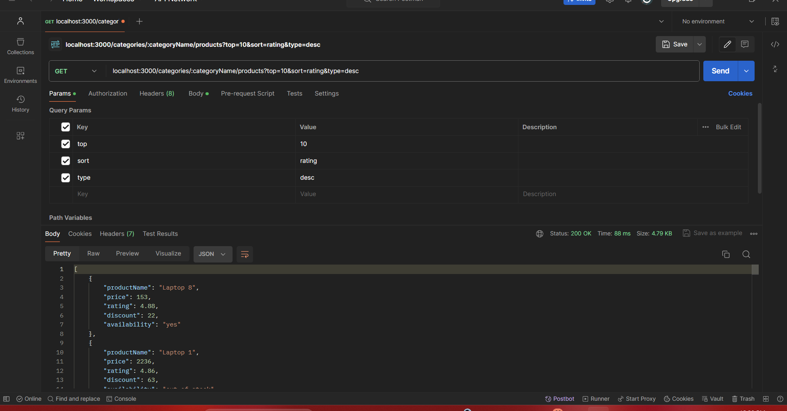
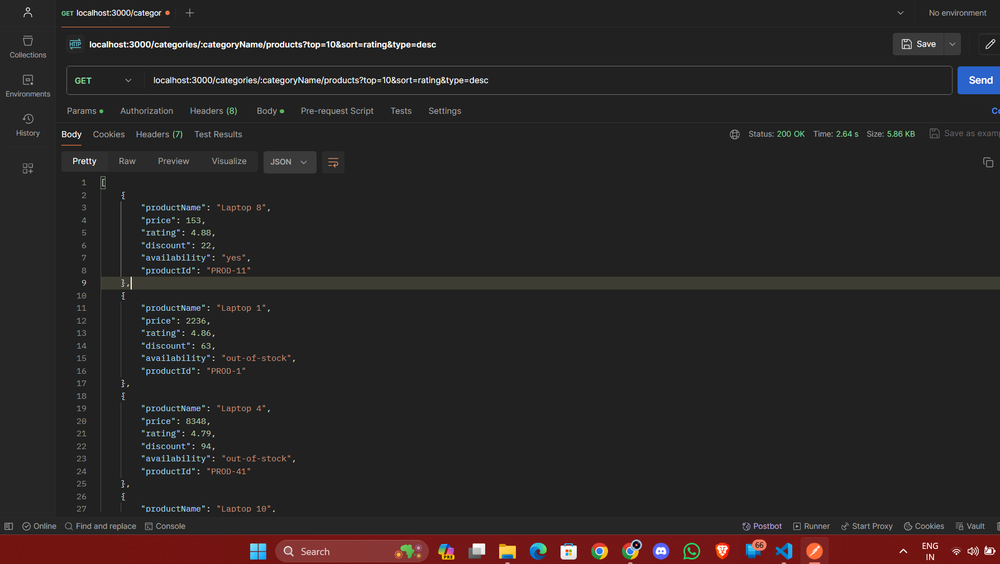

for the first question we need 2 APIs 
and the first one is a get request to get list of products from all companies or specific company and sort them based on ratings,price and discount!
and it works as per shown in image

added product id
and the second api call returns single product based on id provided from prev list 
